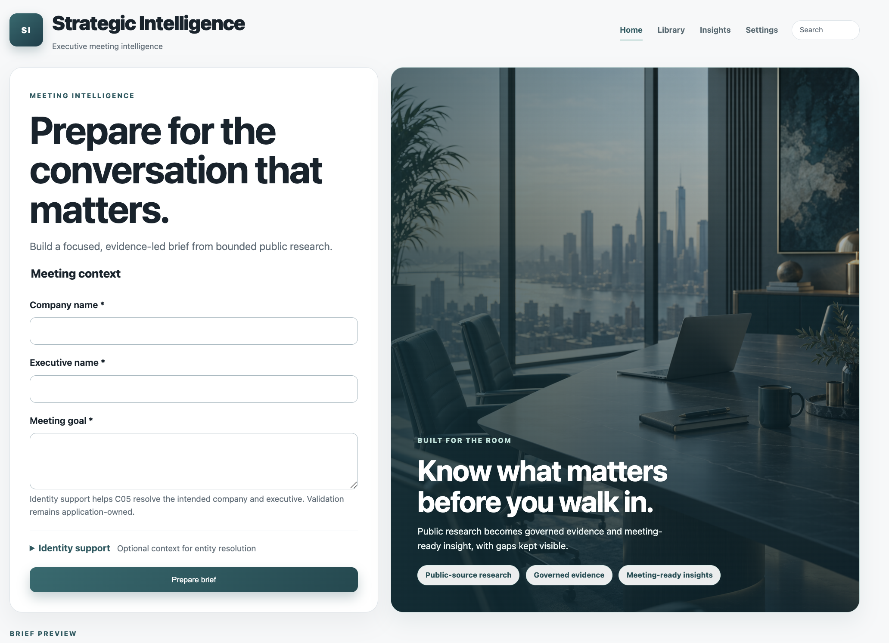

# Strategic Intelligence

**Strategic Intelligence is a governed AI research system for executive meeting preparation.**

It researches bounded public-professional sources, converts them into traceable claims, verifies those claims, applies deterministic governance, and produces a concise meeting brief with visible evidence, provenance, and knowledge gaps.

The system is intentionally **local-first**, **single-user**, and **fail-closed**. An LLM, search provider, or UI cannot override verification, governance, provenance, or the distinction between FACT, INFERENCE, and RECOMMENDATION.

> Current V1.1 regression: **310 tests passing**.

<!-- Add a current V1.1 UI screenshot here after placing it under docs/assets/. -->
## Product Preview



## What it does

A meeting starts with three core inputs:

- company
- executive
- meeting goal

The system then runs a bounded workflow:

```text
Case Validation
  → Identity Resolution
  → Research Planning
  → Public Search & Retrieval
  → Source → Evidence → Claim
  → Verification
  → Bounded Follow-up
  → Governance
  → Strategic Analysis
  → Meeting Brief
  → Persistence / Recovery / Audit
```

The browser UI is a thin loopback-only presentation layer:

```text
Browser UI → WorkflowApplication → WorkflowExecutor → governed system
```

The main result view is intentionally short and meeting-ready:

- **Meeting Snapshot**
- **What You Need to Know**
- **Executive Intelligence**
- **Strategic View** — signals, opportunities, risks
- **Questions to Ask**
- **Knowledge Gaps**

Detailed material is kept behind collapsed **Details** and **Evidence** disclosures so the default view does not become a wall of research text.

If executive-specific public evidence is insufficient, the system explicitly reports limited evidence instead of filling the section with company-level facts or unsupported assumptions.

## Key technical features

- Typed Python domain contracts with Pydantic validation
- Bounded research planning and category budgets
- Provider abstraction for **Gemini**, **Ollama**, deterministic fakes, and public search providers
- Structured LLM output with Gemini-specific JSON Schema projection
- Typed provider failures for authentication, rate limits, timeout, unavailable services, and invalid structured output
- Traceable `Source → Evidence → Claim` provenance
- Claim verification with quality, freshness, fidelity, and conflict checks
- Deterministic Governance with `PASS`, `RESTRICT`, and `BLOCK`
- Explicit separation of `FACT`, `INFERENCE`, and `RECOMMENDATION`
- Provenance-preserving canonical FACT materialization
- SQLite persistence for runs, checkpoints, sources, evidence, claims, governance decisions, and audit events
- Checkpointed recovery from accepted workflow state
- Ordered, redacted audit trail and bounded performance metadata
- Loopback-only local web UI with success, partial, and failure states
- Executive-evidence fail-closed behavior
- Evidence UI exposing safe source URLs, Claim references, and governance qualification
- Deterministic automated regression suite

## Trust and governance model

The trust chain is:

```text
Source
  → Evidence
  → Claim
  → Verification
  → Governance
  → Strategic Analysis
  → Brief
```

Key invariants:

- A factual Claim requires traceable Source and Evidence provenance.
- Verification evaluates evidence fidelity, quality, freshness, and conflicts.
- Governance alone decides `PASS`, `RESTRICT`, or `BLOCK`.
- `BLOCK` material cannot enter analysis or a Brief.
- `RESTRICT` material keeps its qualification and reason codes.
- FACTs preserve exact governed Claim text.
- INFERENCE and RECOMMENDATION remain visibly distinct from FACT.
- Missing executive evidence does not authorize the system to substitute company facts.
- Public-professional research is allowed; private-personal profiling and automated LinkedIn scraping are out of scope.

The Evidence disclosure in the UI exposes existing safe provenance such as source URLs and Claim references while preserving BLOCK filtering and governance boundaries.

See:

- [06_GOVERNANCE_AND_TRUST.md](06_GOVERNANCE_AND_TRUST.md)
- [11_SECURITY_AND_PRIVACY.md](11_SECURITY_AND_PRIVACY.md)
- [07_WORKFLOW_AND_ORCHESTRATION.md](07_WORKFLOW_AND_ORCHESTRATION.md)
- [09_STORAGE_AND_PERSISTENCE.md](09_STORAGE_AND_PERSISTENCE.md)

## Architecture

The durable architecture, provider rules, Golden Case contract, and execution evidence are documented in:

- [02_SYSTEM_ARCHITECTURE.md](02_SYSTEM_ARCHITECTURE.md)
- [08_PROVIDER_ARCHITECTURE.md](08_PROVIDER_ARCHITECTURE.md)
- [16_GOLDEN_CASE_EVALUATION_CONTRACT.md](16_GOLDEN_CASE_EVALUATION_CONTRACT.md)
- [14_CARD_EVIDENCE_MAP.md](14_CARD_EVIDENCE_MAP.md)

Internally, the implementation is tracked through V1 Cards. The user-facing architecture is intentionally described here without requiring knowledge of those Card numbers.

## Clean setup

### Requirements

- Python 3.11
- Git
- Optional: a running local Ollama service for local LLM execution

Clone and install:

```bash
git clone https://github.com/jo-soroush/strategic-intelligence.git
cd strategic-intelligence

python3.11 -m venv .venv
.venv/bin/python -m pip install --upgrade pip
.venv/bin/python -m pip install -e ".[dev]"
.venv/bin/python -m pytest
```

Create an environment file only for your shell. The application does **not** load it automatically, and it must not be committed:

```bash
cp .env.example .env
set -a
source .env
set +a
```

Alternatively, export the documented variables directly in the shell that starts the application.

Secrets remain process-environment values, not source files, domain models, logs, audit events, or Git artifacts.

## Local configuration

The configuration boundary is `strategic_intelligence.config.Settings`. The provider factory is the normal provider-construction path.

| Setting | Default | Meaning |
|---|---|---|
| `APP_ENV` | `development` | Non-secret environment label. |
| `DATA_DIR` / `LOG_DIR` | `data` / `logs` | Relative local runtime directories. |
| `LLM_PROVIDER` | `ollama` | `ollama`, `gemini`, or test-only `fake`. |
| `LLM_MODEL` | provider default | Local default: `llama3.2`; Gemini default: `gemini-3.7-flash`. |
| `LLM_TIMEOUT_SECONDS` | `30` | Positive bounded LLM request timeout. |
| `OLLAMA_BASE_URL` | `http://127.0.0.1:11434` | Loopback Ollama endpoint unless cloud enablement is explicit. |
| `SEARCH_PROVIDER` | `fake` | `fake`, `duckduckgo`, or `brave`. |
| `CLOUD_PROVIDERS_ENABLED` | `false` | Must be `true` to select Gemini. |
| `GEMINI_API_KEY` | unset | Required only for `LLM_PROVIDER=gemini`. |
| `BRAVE_SEARCH_API_KEY` | unset | Required only for `SEARCH_PROVIDER=brave`. |

### Local-first example

```bash
export LLM_PROVIDER=ollama
export LLM_MODEL=llama3.2
export SEARCH_PROVIDER=fake
```

If `llama3.2` is not installed locally, set `LLM_MODEL` to an Ollama model that is actually available on the machine.

### Explicit Gemini + Brave example

```bash
export CLOUD_PROVIDERS_ENABLED=true
export LLM_PROVIDER=gemini
export LLM_MODEL=gemini-3.7-flash
export GEMINI_API_KEY='set-in-your-shell'

export SEARCH_PROVIDER=brave
export BRAVE_SEARCH_API_KEY='set-in-your-shell'
```

There is no silent local-to-cloud fallback. Missing credentials, unavailable models, unsafe network destinations, malformed responses, and provider limits remain typed failures handled by workflow policy.

## Run locally

Start the local browser UI with the configured process environment:

```bash
.venv/bin/python -m strategic_intelligence.ui
```

Open:

```text
http://127.0.0.1:8765
```

The server binds to loopback only.

The form asks for:

- company name
- executive name
- meeting goal
- optional identity-support context

Identity support can include company website, company LinkedIn URL, country/business unit, executive LinkedIn URL, current title, or extra context.

Although identity support is visually optional, C05 may reject intake when the supplied company or executive cannot be resolved safely enough from the provided context.

The UI does not collect provider credentials, expose raw tracebacks, or create a second workflow or trust authority.

Press `Ctrl-C` to stop the server. Local runtime data is stored beneath `DATA_DIR` and is ignored by Git.

## Meeting Brief UI

The V1.1 result view is optimized for fast pre-meeting use rather than maximum information density.

The default view shows only the most useful material:

1. Meeting Snapshot
2. What You Need to Know
3. Executive Intelligence
4. Strategic View
5. Questions to Ask
6. Knowledge Gaps

Long canonical FACT text and detailed section content are moved behind **Details**.

The **Evidence** disclosure shows existing safe provenance, including source URLs and Claim references, without restoring BLOCKed material or inventing new evidence.

If executive-specific evidence is weak or missing, the UI displays:

> Executive evidence is limited. Available public-professional sources do not support a confident executive profile.

This is intentional fail-closed behavior.

## Testing and verification

```bash
# Full deterministic regression suite
.venv/bin/python -m pytest

# Focused trust, provider, persistence, workflow, analysis, brief, and Golden Case surfaces
.venv/bin/python -m pytest \
  tests/unit/test_governance.py \
  tests/unit/test_security_boundaries.py \
  tests/unit/test_providers.py \
  tests/unit/test_persistence.py \
  tests/unit/test_workflow_executor.py \
  tests/unit/test_strategic_analysis.py \
  tests/unit/test_brief_generator.py \
  tests/unit/test_golden_case.py

.venv/bin/python -m compileall -q src
.venv/bin/python -m pip check
git diff --check
```

The automated suite uses deterministic fakes and does not require a live provider call.

Live provider or Golden Case execution is an explicit, separately authorized operation.

At the time of the V1.1 UI closure, the full regression suite reported:

```text
310 passed
```

## Persistence, recovery, and audit

V1 persists durable workflow state in SQLite, including:

- workflow runs
- accepted checkpoints
- sources
- evidence
- claims
- claim/evidence links
- governance decisions
- audit events

Recovery resumes only from accepted persisted checkpoints.

Audit events are ordered and redacted. Raw prompts, raw provider responses, credentials, and raw tracebacks are not intended audit content.

## Golden Case

The versioned V1 Golden Case fixture is:

```text
evaluations/fixtures/c20_capgemini_invent_arash_afsarian_v1.json
```

It is an **evaluation answer key only**. Runtime research, Verification, Governance, Strategic Analysis, and Brief generation must not import or receive it.

The historical C20 Golden Case used **Capgemini Invent / Arash Afsarian** for an enterprise-AI strategy meeting.

The reviewed run:

- matched **12/20** Ground Truth items
- passed mandatory trust invariants
- preserved Source → Evidence → Claim traceability
- passed the human-scored `MeetingValueReview`

The fixture must never be used to seed or improve a runtime run.

## V1 / V1.1 boundaries

The project is intentionally bounded.

It does **not** currently provide:

- multi-user access control
- hosted deployment as a service
- a multi-run management dashboard
- historical run browsing in the local UI
- distributed telemetry
- automatic LinkedIn scraping
- private-personal profiling
- a vector database or embedding stack
- unbounded autonomous research
- automatic provider/model routing
- silent local-to-cloud fallback

These are possible future directions, not implied commitments.

The system may return `PARTIAL`, visible Knowledge Gaps, `RESTRICT`, or `BLOCK` rather than fabricate completeness.

A successful workflow run is not permission to treat unverified material as FACT.

## Repository navigation

| Path | Use it for |
|---|---|
| `README.md` | Product overview, setup, local run, configuration, tests, and demo orientation. |
| `02_SYSTEM_ARCHITECTURE.md` | Implemented V1 topology and ownership map. |
| `06_GOVERNANCE_AND_TRUST.md` | Trust model and deterministic governance rules. |
| `07_WORKFLOW_AND_ORCHESTRATION.md` | Workflow stages and orchestration boundaries. |
| `08_PROVIDER_ARCHITECTURE.md` | Provider contracts, configuration, errors, and safety boundary. |
| `09_STORAGE_AND_PERSISTENCE.md` | SQLite persistence, checkpoints, and recovery. |
| `11_SECURITY_AND_PRIVACY.md` | Security, privacy, and public-professional research boundaries. |
| `16_GOLDEN_CASE_EVALUATION_CONTRACT.md` | Golden Case rubric and mandatory trust gate. |
| `12_V1_ROADMAP.md` | Planned Card sequence. |
| `13_CARD_SPECIFICATIONS.md` | Planned Card contracts. |
| `14_CARD_EVIDENCE_MAP.md` | Actual Card evidence and learning history. |
| `15_CODEX_EXECUTION_PROTOCOL.md` | Git delivery procedure. |
| `AGENTS.md` | Repository execution and safety rules. |

## Project status

- V1 Final Evidence Gate: **PASS**
- V1: **COMPLETE**
- V1.1 UI/Product Polish: **validated locally**
- Full regression at V1.1 validation: **310 passed**
